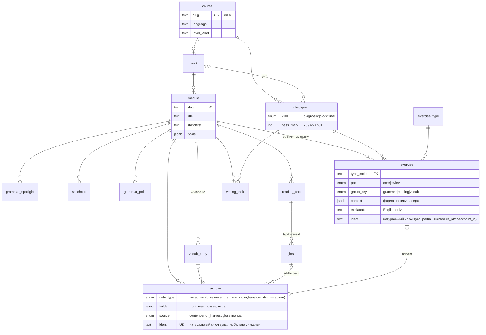
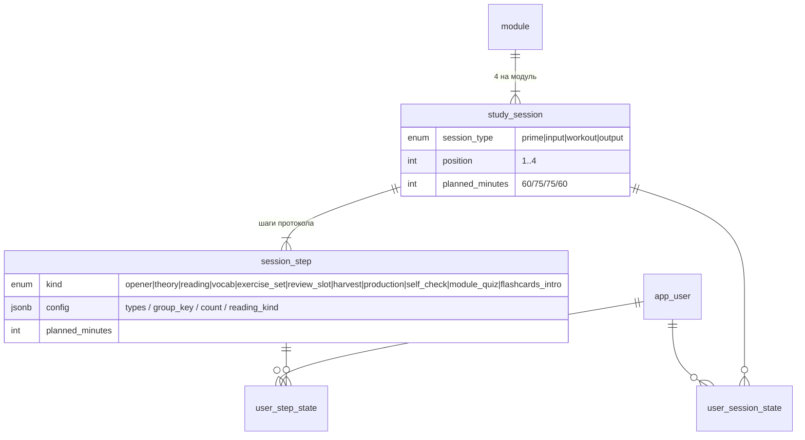
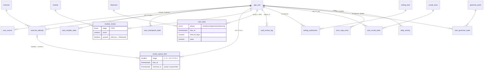

# SkyRocket · Data Model — Neon Postgres

Схема данных курс-агностичного движка изучения языков: контент модулей, недельный протокол сессий, пользователи и три колеи повторений. Спроектирована по утверждённому дизайну (`docs/design/skyrocket/` — `content.js` задаёт формы данных экранов), дизайн-брифу и плану курса (`courses/en-c1/PLAN.md`). Миграции: `db/migrations/0001_init.sql` (DDL + сид типов упражнений), `db/migrations/0002_seed_en_c1_skeleton.sql` (каркас курса en-c1), `db/migrations/0003_content_natural_keys.sql` (стабильные натуральные ключи `ident` для `exercise`/`writing_task`/`flashcard` — см. ниже), `db/migrations/0004_dose_theory_vocab_across_sessions.sql` (пересев `session_step`: дозирование теории/лексики по сессиям, детали шагов = микро-цели; DDL не меняет, сбрасывает `user_step_state`/`user_session_state` курса en-c1), `db/migrations/0006_course_skeleton_from_yaml.sql` (`course.skeleton_hash`).

**Структура курса больше не задаётся миграциями.** `0002` и `0004` остаются применёнными как история, но каркас (`course`, `block`, `module`, `checkpoint`, `study_session`, `session_step`) теперь приходит из `courses/<slug>/course.yaml` через `pnpm sync`, который апсертит его по натуральным ключам этих таблиц. Новый курс или правка протокола — это правка YAML, а не новая миграция (см. `docs/ARCHITECTURE.md` §4.1).

## Принципы

1. **Контент отделён от прогресса.** Контент-таблицы заполняются sync-скриптом из `courses/<slug>/content/` идемпотентно по `content_hash` (паттерн проверен в interview-prep). Прогресс — только пользовательские таблицы; контент можно пересинкать без потери прогресса.
2. **Типизированные упражнения.** У упражнения `type_code` (8 типов плеера) и `content jsonb`, форма которого повторяет утверждённый дизайн один в один — приложение рендерит без адаптеров.
3. **Три колеи повторений — три механики.** Флешкарты (`card_state`, SRS с оценками 1–4), возврат ошибочных упражнений (`review_queue_item`, +2/+7/+21 день), ревью модулей (`module_review`, +7/+21 день). Частичные индексы `user_id + due_at` делают запрос «что должно сегодня» дешёвым.
4. **Чек-пойнты — ворота, не модули.** Диагностика, чек-пойнты блоков и финальный мок — сущность `checkpoint` (на карте — футер блока, как в дизайне). Упражнения и письменные задания принадлежат либо модулю, либо чек-пойнту (CHECK-ограничение).
5. **Мультикурсовость с первого дня.** `course` → `block` → `module`; немецкий — ещё одна строка в `course` и свой корень контента.

## ER-диаграммы

### Структура курса и контент



### Недельный протокол сессий



### Пользователь и прогресс



## Справочник таблиц

### Структура курса

| Таблица | Назначение | Ключевое |
|---|---|---|
| `course` | Курс (язык) | `slug` unique; `level_label` для шапки («B2+ → C1») |
| `block` | Блок из 4 модулей | `color`/`tint` — цветовой код карты; unique(course, slug) |
| `module` | Учебный модуль-неделя | `standfirst`, `goals jsonb` — с 0004 канонически `[{text, achieved_by}]`, где `achieved_by` — сессия, закрывающая цель (ARCHITECTURE §8 D12); unique(block, slug) |
| `checkpoint` | Ворота: диагностика / чек-пойнт блока / финальный мок | `kind`; `pass_mark` (null у диагностики, 75 у блоков, 65 у финала); CHECK связки kind↔block |

### Контент модуля (sync из `content/`)

| Таблица | Назначение | Ключевое |
|---|---|---|
| `grammar_spotlight` | Панель теории юнита | `items jsonb` `[{form, example, note}]` |
| `watchout` | Панель «Watch out!» | `bad_example` / `good_example` / `note` |
| `grammar_point` | Конструкции модуля | база статуса Reliable; unique(module, title) |
| `reading_text` | Лонгрид и доп. текст | `body jsonb` — абзацы из сегментов `{t}` / `{g: key}` |
| `gloss` | Тап-глоссы текста | unique(text, key); «Add to deck» — источник карточки |
| `vocab_entry` | Лексика 45/модуль | `use_cases jsonb` (2–3 примера), `tag`, `collocations`, `register_note` |
| `exercise_type` | Справочник 8 типов | `interaction`: choice / text_input / word_tap / match; сид в 0001 |
| `exercise` | Задание | владелец: модуль XOR чек-пойнт; `pool` core/review; `group_key` — лончеры юнита; `content jsonb` по типу; `explanation` EN; `ident` (0003) — натуральный ключ sync, partial unique `(module_id, ident)`/`(checkpoint_id, ident)` |
| `writing_task` | Письмо / спикинг | `mode`, `genre`, `model_answer_md`, `checklist jsonb`; `ident` (0003) — натуральный ключ sync, partial unique `(module_id, ident)`/`(checkpoint_id, ident)` |
| `flashcard` | Карточка (3 note-типа) | `fields jsonb` `{front, main, cases, extra}`; `source`: content / error_harvest / gloss / manual + ссылки на источник; `ident` (0003) — натуральный ключ sync, глобально unique |

### Протокол сессий

| Таблица | Назначение | Ключевое |
|---|---|---|
| `study_session` | 4 сессии недели | unique(module, session_type); Prime 60 / Input 75 / Workout 75 / Output 60; открываются строго по порядку (жёсткий гейтинг, ARCHITECTURE §8 D11 — состояние выводится из `user_session_state.status`, отдельной колонки нет) |
| `session_step` | Шаги сессии | `kind` + `config jsonb` (`{"group_key":"vocab"}`, `{"types":[…]}`, `{"count":10}`, дозирование `{"part":P,"of":N}` / `{"batch":B,"of":N}`) — из них рендерится Today; `detail` = микро-цель шага. Матрица пересеяна миграцией `0004_dose_theory_vocab_across_sessions.sql`: теория в 2 частях (Prime/Workout), лексика в 3 партиях (Prime/Input×2), 5+6+5+4 шагов |

### Пользователь и прогресс

| Таблица | Назначение | Ключевое |
|---|---|---|
| `app_user` | Пользователи | bcrypt-хеш; auth-паттерн interview-prep (bcrypt + jose) |
| `user_course` | Подписка на курс | мультикурсовость |
| `user_module_state` | Статус модуля | locked → upcoming → in_progress → completed → mastered; `quiz_score` |
| `user_checkpoint_state` | Статус ворот | locked / available / passed / failed; `best_score` |
| `user_session_state`, `user_step_state` | Прогресс по протоколу | «Session 2 of 4» на Today |
| `exercise_attempt` | Каждая попытка | `context` (session / review_slot / module_quiz / module_review / checkpoint / practice); `given_answer jsonb` |
| `review_queue_item` | Колея 2 | `stage` 1–3 (+2/+7/+21 д); partial-unique на нерешённые; partial-index (user, due_at) |
| `module_review` | Колея 3 | `stage` r7/r21; unique(user, module, stage); оба passed → Mastered |
| `card_state` | Колея 1 (SRS) | PK(user, card); `phase`, `due_at`, `interval_days`, `ease`, `reps`, `lapses` — SM-2/FSRS-agnostic |
| `card_review_log` | История повторов | `rating` 1–4 (Again/Hard/Good/Easy) — метрики retention |
| `writing_submission` | Сочинения | `body_md`, `self_check jsonb`, `attachment_url` (спикинг-запись) |
| `user_vocab_state` | Статус лексемы | new → learning → known → in_use; ссылка на сочинение, где употреблена |
| `user_grammar_state` | Статус конструкции | introduced → practising → reliable; `success_count` |
| `error_map_entry` | Карта ошибок | источник (exercise / writing / manual) → правило → карточка |
| `daily_activity` | Дневная сводка | PK(user, date); стрик и heatmap без тяжёлых агрегатов |

## Типовые запросы (проверены на Postgres 16)

```sql
-- Колея 2: что должно сегодня (Index Scan по review_queue_due_idx)
select * from review_queue_item
where user_id = $1 and resolved_at is null and due_at <= now()
order by due_at;

-- Карта курса: блоки → модули со статусами (+ чек-пойнты аналогично)
select b.name, m.slug, m.title, coalesce(ums.status::text, 'locked') as status
from block b
join module m on m.block_id = b.id
left join user_module_state ums on ums.module_id = m.id and ums.user_id = $1
order by b.position, m.position;

-- Шаги текущей сессии для Today
select ss.position, ss.kind, ss.title, ss.planned_minutes, ss.config
from session_step ss
join study_session s on s.id = ss.study_session_id
where s.module_id = $1 and s.session_type = $2
order by ss.position;

-- Прогресс: доля лексики Known+
select count(*) filter (where uvs.status in ('known','in_use')) as known_plus, count(*) as total
from vocab_entry ve
left join user_vocab_state uvs on uvs.vocab_entry_id = ve.id and uvs.user_id = $1;
```

## Применение

```bash
psql "$DATABASE_URL" -f db/migrations/0001_init.sql
psql "$DATABASE_URL" -f db/migrations/0002_seed_en_c1_skeleton.sql
psql "$DATABASE_URL" -f db/migrations/0003_content_natural_keys.sql
```

(В приложении `web/` эти три файла применяет `scripts/migrate.ts` — идемпотентный раннер на `pg` с таблицей учёта `schema_migrations`, см. `docs/ARCHITECTURE.md` §3.2.)

Проверено на чистом PostgreSQL 16 (docker): все три миграции применяются без ошибок; каркас — 1 курс, 4 блока, 15 модулей, 5 чек-пойнтов, 60 сессий, 255 шагов, 8 типов упражнений; сценарий «ошибка → очередь повторений» и запросы всех трёх колей работают, частичные индексы задействованы (`EXPLAIN`). После 0003 подтверждено на реальном sync module-01: `exercise`/`writing_task`/`flashcard` upsert по `ident` стабильно сохраняет `id` при пересинке и переупорядочивании контента, прунинг удалённых сущностей не задевает `id` остальных строк.

---

## Полный SQL

### db/migrations/0001_init.sql

```sql
-- 0001_init.sql — SkyRocket: course engine schema (Neon / PostgreSQL 15+)
-- Course structure, module content, weekly session protocol, users,
-- and the three repetition lanes (flashcard SRS, exercise re-queue, module reviews).
-- Content tables carry content_hash for idempotent sync from content/<course>/.
-- Apply: psql "$DATABASE_URL" -f db/migrations/0001_init.sql

begin;

-- ============================================================ enums

create type checkpoint_kind  as enum ('diagnostic','block','final');
create type reading_kind     as enum ('main','extra');
create type exercise_pool    as enum ('core','review');
create type exercise_group   as enum ('grammar','reading','vocab');
create type task_mode        as enum ('writing','speaking');
create type note_type        as enum ('vocab','grammar_cloze','transformation');
-- 0005: + 'vocab_reverse'. Колода стала лексической (две стороны на слово);
-- grammar_cloze/transformation остаются в enum только ради архивных строк —
-- новые не создаются, задания живут в exercise + review_queue_item (ARCHITECTURE D9).
create type flashcard_source as enum ('content','error_harvest','gloss','manual');
create type session_type     as enum ('prime','input','workout','output');
create type step_kind        as enum ('opener','theory','reading','vocab','exercise_set',
                                      'review_slot','harvest','production','self_check',
                                      'module_quiz','flashcards_intro');
create type module_status     as enum ('locked','upcoming','in_progress','completed','mastered');
create type checkpoint_status as enum ('locked','available','passed','failed');
create type progress_status   as enum ('not_started','in_progress','done');
create type attempt_context   as enum ('session','review_slot','module_quiz','module_review',
                                       'checkpoint','practice');
create type card_phase        as enum ('new','learning','review','relearning');
create type vocab_status      as enum ('new','learning','known','in_use');
create type grammar_status    as enum ('introduced','practising','reliable');
create type review_stage      as enum ('r7','r21');
create type error_source      as enum ('exercise','writing','manual');

-- ============================================================ users

create table app_user (
  id            bigint generated always as identity primary key,
  username      text not null unique,
  password_hash text not null,
  created_at    timestamptz not null default now()
);

-- ============================================================ course structure

create table course (
  id          bigint generated always as identity primary key,
  slug        text not null unique,          -- 'en-c1', 'de-a1'
  language    text not null,                 -- 'en', 'de'
  name        text not null,                 -- 'English'
  level_label text not null,                 -- 'B2+ → C1'
  position    int  not null default 1,
  is_active   boolean not null default true,
  created_at  timestamptz not null default now()
);

create table block (
  id        bigint generated always as identity primary key,
  course_id bigint not null references course(id) on delete cascade,
  slug      text not null,                   -- 'a'..'d'
  name      text not null,
  color     text not null,                   -- block accent, hex
  tint      text not null,                   -- block background tint, hex
  position  int  not null,
  unique (course_id, slug),
  unique (course_id, position)
);

create table module (
  id              bigint generated always as identity primary key,
  block_id        bigint not null references block(id) on delete cascade,
  slug            text not null,             -- 'm01'
  title           text not null,             -- 'Work & Careers'
  standfirst      text,                      -- unit subtitle line
  goals           jsonb not null default '[]',  -- ["can-do …", …]
  planned_minutes int  not null default 270,
  position        int  not null,
  content_hash    text,
  unique (block_id, slug),
  unique (block_id, position)
);

-- Gates: block checkpoints, the course diagnostic and the final mock.
create table checkpoint (
  id              bigint generated always as identity primary key,
  course_id       bigint not null references course(id) on delete cascade,
  block_id        bigint references block(id) on delete cascade,
  kind            checkpoint_kind not null,
  slug            text not null,
  title           text not null,
  pass_mark       int,                       -- null for diagnostic (no gate)
  planned_minutes int not null default 120,
  position        int not null,
  content_hash    text,
  unique (course_id, slug),
  constraint checkpoint_block_by_kind check (
    (kind = 'diagnostic' and block_id is null)
    or (kind in ('block','final') and block_id is not null)
  )
);

-- ============================================================ module content

create table grammar_spotlight (
  id           bigint generated always as identity primary key,
  module_id    bigint not null references module(id) on delete cascade,
  title        text not null,
  intro        text,
  items        jsonb not null default '[]',  -- [{form, example, note}]
  position     int not null default 1,
  content_hash text,
  unique (module_id, position)
);

create table watchout (
  id           bigint generated always as identity primary key,
  module_id    bigint not null references module(id) on delete cascade,
  title        text not null,
  bad_example  text not null,
  good_example text not null,
  note         text,
  position     int not null default 1,
  content_hash text,
  unique (module_id, position)
);

-- Constructions of the module (the Reliable ladder on the Progress screen).
create table grammar_point (
  id           bigint generated always as identity primary key,
  module_id    bigint not null references module(id) on delete cascade,
  title        text not null,
  position     int not null default 1,
  content_hash text,
  unique (module_id, title)
);

create table reading_text (
  id           bigint generated always as identity primary key,
  module_id    bigint not null references module(id) on delete cascade,
  kind         reading_kind not null,
  kicker       text,                         -- 'LONG-READ · PART B'
  title        text not null,
  meta         text,
  body         jsonb not null,               -- [[{"t":"…"}|{"g":"gloss_key"}], …]
  word_count   int,
  position     int not null default 1,
  content_hash text,
  unique (module_id, kind, position)
);

-- Tap-to-reveal glosses inside reading texts; each is harvestable into the deck.
create table gloss (
  id              bigint generated always as identity primary key,
  reading_text_id bigint not null references reading_text(id) on delete cascade,
  key             text not null,             -- referenced from reading_text.body segments
  term            text not null,
  pos_label       text,                      -- 'idiom', 'verb · business register'
  definition      text not null,
  example         text,
  unique (reading_text_id, key)
);

create table vocab_entry (
  id            bigint generated always as identity primary key,
  module_id     bigint not null references module(id) on delete cascade,
  term          text not null,
  tag           text,                        -- badge: 'neutral', 'idiom · often ironic'
  definition    text not null,
  use_cases     jsonb not null default '[]', -- ["example 1", "example 2", …]
  collocations  text,
  register_note text,
  position      int not null,
  content_hash  text,
  unique (module_id, term)
);

create table exercise_type (
  code        text primary key,
  label       text not null,
  interaction text not null                  -- choice | text_input | word_tap | match
);

create table exercise (
  id               bigint generated always as identity primary key,
  module_id        bigint references module(id) on delete cascade,
  checkpoint_id    bigint references checkpoint(id) on delete cascade,
  type_code        text not null references exercise_type(code),
  pool             exercise_pool not null default 'core',   -- core 66 / review 30 per module
  group_key        exercise_group,                          -- unit launchers: grammar/reading/vocab
  grammar_point_id bigint references grammar_point(id) on delete set null,
  reading_text_id  bigint references reading_text(id) on delete set null,
  content          jsonb not null,           -- type-specific, shapes mirror the design player
  explanation      text not null,            -- English-only answer explanation
  position         int not null default 1,
  content_hash     text,
  constraint exercise_owner check ((module_id is null) <> (checkpoint_id is null))
);
create index exercise_module_idx     on exercise (module_id, pool);
create index exercise_checkpoint_idx on exercise (checkpoint_id);

create table writing_task (
  id              bigint generated always as identity primary key,
  module_id       bigint references module(id) on delete cascade,
  checkpoint_id   bigint references checkpoint(id) on delete cascade,
  mode            task_mode not null,
  genre           text not null,
  prompt_md       text not null,
  model_answer_md text,
  checklist       jsonb not null default '[]',
  position        int not null default 1,
  content_hash    text,
  constraint writing_task_owner check ((module_id is null) <> (checkpoint_id is null))
);

create table flashcard (
  id                 bigint generated always as identity primary key,
  module_id          bigint references module(id) on delete set null,
  note_type          note_type not null,
  fields             jsonb not null,         -- {front, main, cases: [], extra}
  source             flashcard_source not null default 'content',
  vocab_entry_id     bigint references vocab_entry(id) on delete set null,
  source_exercise_id bigint references exercise(id) on delete set null,
  source_gloss_id    bigint references gloss(id) on delete set null,
  created_by_user_id bigint references app_user(id) on delete set null,
  archived           boolean not null default false,
  content_hash       text,
  created_at         timestamptz not null default now()
);
create index flashcard_module_idx on flashcard (module_id);

-- ============================================================ weekly session protocol

create table study_session (
  id              bigint generated always as identity primary key,
  module_id       bigint not null references module(id) on delete cascade,
  session_type    session_type not null,
  position        int not null,              -- 1..4
  title           text not null,             -- 'Prime', 'Input', 'Workout', 'Output'
  planned_minutes int not null,
  unique (module_id, session_type),
  unique (module_id, position)
);

create table session_step (
  id               bigint generated always as identity primary key,
  study_session_id bigint not null references study_session(id) on delete cascade,
  position         int not null,
  kind             step_kind not null,
  title            text not null,
  detail           text,
  planned_minutes  int not null default 10,
  config           jsonb not null default '{}',
  unique (study_session_id, position)
);

-- ============================================================ user progress

create table user_course (
  user_id    bigint not null references app_user(id) on delete cascade,
  course_id  bigint not null references course(id) on delete cascade,
  started_at timestamptz not null default now(),
  is_active  boolean not null default true,
  primary key (user_id, course_id)
);

create table user_module_state (
  user_id      bigint not null references app_user(id) on delete cascade,
  module_id    bigint not null references module(id) on delete cascade,
  status       module_status not null default 'locked',
  started_at   timestamptz,
  completed_at timestamptz,                  -- session 4 module quiz done
  quiz_score   numeric(5,2),
  mastered_at  timestamptz,                  -- both module reviews passed
  primary key (user_id, module_id)
);

create table user_checkpoint_state (
  user_id       bigint not null references app_user(id) on delete cascade,
  checkpoint_id bigint not null references checkpoint(id) on delete cascade,
  status        checkpoint_status not null default 'locked',
  best_score    numeric(5,2),
  taken_at      timestamptz,
  primary key (user_id, checkpoint_id)
);

create table user_session_state (
  user_id          bigint not null references app_user(id) on delete cascade,
  study_session_id bigint not null references study_session(id) on delete cascade,
  status           progress_status not null default 'not_started',
  started_at       timestamptz,
  completed_at     timestamptz,
  primary key (user_id, study_session_id)
);

create table user_step_state (
  user_id         bigint not null references app_user(id) on delete cascade,
  session_step_id bigint not null references session_step(id) on delete cascade,
  status          progress_status not null default 'not_started',
  completed_at    timestamptz,
  primary key (user_id, session_step_id)
);

create table exercise_attempt (
  id           bigint generated always as identity primary key,
  user_id      bigint not null references app_user(id) on delete cascade,
  exercise_id  bigint not null references exercise(id) on delete cascade,
  context      attempt_context not null,
  given_answer jsonb,
  is_correct   boolean not null,
  time_ms      int,
  answered_at  timestamptz not null default now()
);
create index attempt_user_time_idx on exercise_attempt (user_id, answered_at);
create index attempt_user_ex_idx   on exercise_attempt (user_id, exercise_id);

-- Lane 2: failed exercises return as fresh variants at +2 / +7 / +21 days.
create table review_queue_item (
  id                  bigint generated always as identity primary key,
  user_id             bigint not null references app_user(id) on delete cascade,
  exercise_id         bigint not null references exercise(id) on delete cascade,
  stage               smallint not null default 1 check (stage between 1 and 3),
  due_at              timestamptz not null,
  source_attempt_id   bigint references exercise_attempt(id) on delete set null,
  resolved_at         timestamptz,
  resolved_attempt_id bigint references exercise_attempt(id) on delete set null,
  created_at          timestamptz not null default now()
);
create unique index review_queue_open_uniq on review_queue_item (user_id, exercise_id)
  where resolved_at is null;
create index review_queue_due_idx on review_queue_item (user_id, due_at)
  where resolved_at is null;

-- Lane 3: +7-day and +21-day module quizzes; both ≥ pass promote the module to Mastered.
create table module_review (
  id        bigint generated always as identity primary key,
  user_id   bigint not null references app_user(id) on delete cascade,
  module_id bigint not null references module(id) on delete cascade,
  stage     review_stage not null,
  due_at    timestamptz not null,
  taken_at  timestamptz,
  score     numeric(5,2),
  passed    boolean,
  unique (user_id, module_id, stage)
);
create index module_review_due_idx on module_review (user_id, due_at)
  where taken_at is null;

-- Lane 1: per-card scheduling state. Algorithm-agnostic (SM-2 / FSRS both fit).
create table card_state (
  user_id          bigint not null references app_user(id) on delete cascade,
  flashcard_id     bigint not null references flashcard(id) on delete cascade,
  phase            card_phase not null default 'new',
  due_at           timestamptz not null default now(),
  interval_days    numeric(8,2) not null default 0,
  ease             numeric(5,2) not null default 2.5,
  reps             int not null default 0,
  lapses           int not null default 0,
  last_reviewed_at timestamptz,
  primary key (user_id, flashcard_id)
);
create index card_state_due_idx on card_state (user_id, due_at);

create table card_review_log (
  id           bigint generated always as identity primary key,
  user_id      bigint not null references app_user(id) on delete cascade,
  flashcard_id bigint not null references flashcard(id) on delete cascade,
  rating       smallint not null check (rating between 1 and 4),  -- Again/Hard/Good/Easy
  prev_phase   card_phase,
  new_due_at   timestamptz,
  reviewed_at  timestamptz not null default now()
);
create index card_log_user_time_idx on card_review_log (user_id, reviewed_at);

create table writing_submission (
  id              bigint generated always as identity primary key,
  user_id         bigint not null references app_user(id) on delete cascade,
  writing_task_id bigint not null references writing_task(id) on delete cascade,
  body_md         text not null,
  duration_min    int,
  self_check      jsonb,                     -- checklist ticks
  attachment_url  text,                      -- speaking recording
  submitted_at    timestamptz not null default now()
);
create index submission_user_idx on writing_submission (user_id, submitted_at);

create table user_vocab_state (
  user_id              bigint not null references app_user(id) on delete cascade,
  vocab_entry_id       bigint not null references vocab_entry(id) on delete cascade,
  status               vocab_status not null default 'new',
  in_use_submission_id bigint references writing_submission(id) on delete set null,
  updated_at           timestamptz not null default now(),
  primary key (user_id, vocab_entry_id)
);

create table user_grammar_state (
  user_id          bigint not null references app_user(id) on delete cascade,
  grammar_point_id bigint not null references grammar_point(id) on delete cascade,
  status           grammar_status not null default 'introduced',
  success_count    int not null default 0,
  updated_at       timestamptz not null default now(),
  primary key (user_id, grammar_point_id)
);

create table error_map_entry (
  id                   bigint generated always as identity primary key,
  user_id              bigint not null references app_user(id) on delete cascade,
  module_id            bigint references module(id) on delete set null,
  source               error_source not null,
  source_attempt_id    bigint references exercise_attempt(id) on delete set null,
  source_submission_id bigint references writing_submission(id) on delete set null,
  error_text           text not null,
  rule_note            text,
  flashcard_id         bigint references flashcard(id) on delete set null,
  created_at           timestamptz not null default now(),
  resolved_at          timestamptz
);
create index error_map_user_idx on error_map_entry (user_id, created_at);

-- Streak and heatmap without heavy aggregate queries; app upserts one row per day.
create table daily_activity (
  user_id        bigint not null references app_user(id) on delete cascade,
  activity_date  date not null,
  exercises_done int not null default 0,
  cards_reviewed int not null default 0,
  minutes        int not null default 0,
  primary key (user_id, activity_date)
);

-- ============================================================ reference seed

insert into exercise_type (code, label, interaction) values
  ('mc_cloze',                'Multiple-choice cloze',    'choice'),
  ('open_cloze',              'Open cloze',               'text_input'),
  ('word_formation',          'Word formation',           'text_input'),
  ('key_word_transformation', 'Key-word transformation',  'text_input'),
  ('grammar_drill',           'Grammar drill',            'choice'),
  ('error_correction',        'Error correction',         'word_tap'),
  ('collocation_match',       'Collocation match',        'match'),
  ('reading_comprehension',   'Reading comprehension',    'choice');

commit;
```

### db/migrations/0002_seed_en_c1_skeleton.sql

```sql
-- 0002_seed_en_c1_skeleton.sql — course skeleton for English B2+ → C1.
-- Course, blocks A–D, modules m01–m15, five checkpoints (diagnostic, A–C, final mock)
-- and the fixed weekly protocol: 4 study sessions × steps for every module.
-- Module content (texts, vocabulary, exercises, flashcards, writing tasks, goals)
-- is NOT seeded here — it arrives via the content sync from content/en-c1/.

begin;

insert into course (slug, language, name, level_label, position)
values ('en-c1', 'en', 'English', 'B2+ → C1', 1);

insert into block (course_id, slug, name, color, tint, position)
select c.id, v.slug, v.name, v.color, v.tint, v.position
from course c,
     (values
       ('a', 'Consolidate', '#2E7FC7', '#E8F0F8', 1),
       ('b', 'Expand',      '#3D63CE', '#E9EDFA', 2),
       ('c', 'Refine',      '#5A4AC8', '#ECEAF9', 3),
       ('d', 'Command',     '#7C3FB5', '#F2EAF8', 4)
     ) as v(slug, name, color, tint, position)
where c.slug = 'en-c1';

insert into module (block_id, slug, title, standfirst, position, planned_minutes)
select b.id, v.slug, v.title, v.standfirst, v.position, 270
from (values
  ('a', 'm01', 1, 'Work & Careers',
   'Narrative tenses, perfect aspect and future forms for career stories · 45 lexemes with use cases · a formal application email.'),
  ('a', 'm02', 2, 'Science & Technology',
   'Advanced passives and causatives for science writing · 45 lexemes · a recorded monologue.'),
  ('a', 'm03', 3, 'Media & Communication',
   'Reporting verbs and their patterns · 45 lexemes · an opinion article.'),
  ('a', 'm04', 4, 'Education & Learning',
   'Gerund vs infinitive pairs that change meaning · 45 lexemes · a recorded monologue.'),
  ('b', 'm05', 1, 'Environment & Sustainability',
   'Mixed and inverted conditionals · 45 lexemes · CAE essay #1.'),
  ('b', 'm06', 2, 'Society & Inequality',
   'Unreal past and the subjunctive · 45 lexemes · a recorded monologue.'),
  ('b', 'm07', 3, 'Health & Psychology',
   'Modality: speculation and degrees of certainty · 45 lexemes · an informal email.'),
  ('b', 'm08', 4, 'Globalisation & Travel',
   'Advanced relative and participle clauses · 45 lexemes · a recorded monologue.'),
  ('c', 'm09', 1, 'Culture & Arts',
   'Cleft sentences, fronting and emphasis · 45 lexemes · a review.'),
  ('c', 'm10', 2, 'Crime & Justice',
   'Inversion after negative adverbials · 45 lexemes · a recorded monologue.'),
  ('c', 'm11', 3, 'Business & Economy',
   'Nominalisation and formal register · 45 lexemes · a report.'),
  ('c', 'm12', 4, 'Language & Identity',
   'Ellipsis, substitution and discourse markers · 45 lexemes · a recorded monologue.'),
  ('d', 'm13', 1, 'Ethics & AI',
   'Hedging and concession for balanced argument · 45 lexemes · timed CAE essay #2.'),
  ('d', 'm14', 2, 'Consumer Society',
   'Dependent prepositions, comparison and quantifiers · 45 lexemes · a recorded monologue.'),
  ('d', 'm15', 3, 'Global Challenges',
   'Sentence architecture and cohesion for long-form writing · 45 lexemes · a proposal.')
) as v(block_slug, slug, position, title, standfirst)
join block b on b.slug = v.block_slug
join course c on c.id = b.course_id and c.slug = 'en-c1';

insert into checkpoint (course_id, block_id, kind, slug, title, pass_mark, planned_minutes, position)
select c.id,
       case when v.block_slug is null then null else b.id end,
       v.kind::checkpoint_kind, v.slug, v.title, v.pass_mark, v.minutes, v.position
from (values
  (null, 'diagnostic', 'diagnostic',
   'Diagnostic · 60 Use of English items + essay + monologue', null, 120, 0),
  ('a',  'block', 'cp-a', 'Checkpoint A · modules 1–4',  75, 120, 1),
  ('b',  'block', 'cp-b', 'Checkpoint B · modules 5–8',  75, 120, 2),
  ('c',  'block', 'cp-c', 'Checkpoint C · modules 9–12', 75, 120, 3),
  ('d',  'final', 'final',
   'Final mock · CAE Reading & Use of English + Writing', 65, 270, 4)
) as v(block_slug, kind, slug, title, pass_mark, minutes, position)
join course c on c.slug = 'en-c1'
left join block b on b.course_id = c.id and b.slug = v.block_slug
where v.block_slug is null or b.id is not null;

-- ---------------------------------------------------------- weekly protocol

insert into study_session (module_id, session_type, position, title, planned_minutes)
select m.id, v.stype::session_type, v.position, v.title, v.minutes
from module m
join block b  on b.id = m.block_id
join course c on c.id = b.course_id and c.slug = 'en-c1'
cross join (values
  ('prime',   1, 'Prime',   60),
  ('input',   2, 'Input',   75),
  ('workout', 3, 'Workout', 75),
  ('output',  4, 'Output',  60)
) as v(stype, position, title, minutes);

insert into session_step (study_session_id, position, kind, title, detail, planned_minutes, config)
select s.id, v.position, v.kind::step_kind, v.title, v.detail, v.minutes, v.config::jsonb
from study_session s
join module m on m.id = s.module_id
join block b  on b.id = m.block_id
join course c on c.id = b.course_id and c.slug = 'en-c1'
join (values
  -- Session 1 · Prime — enter the topic
  ('prime',   1, 'opener',           'Unit opener',
   'Goals and can-do statements for the week',                        5,  '{}'),
  ('prime',   2, 'reading',          'Skim the long-read',
   'No dictionary — gist only',                                       10, '{"reading_kind":"main","mode":"skim"}'),
  ('prime',   3, 'theory',           'Grammar spotlight',
   'Rules, examples and Watch out! boxes',                            25, '{}'),
  ('prime',   4, 'vocab',            'Vocabulary studio',
   '45 lexemes with use cases — mark 10 priority items',              15, '{"count":45}'),
  ('prime',   5, 'flashcards_intro', 'New cards into rotation',
   'Module decks join the daily review queue',                        5,  '{}'),
  -- Session 2 · Input — deep reading
  ('input',   1, 'review_slot',      'Review Slot',
   '10 items from the exercise re-queue',                             12, '{"count":10}'),
  ('input',   2, 'reading',          'Close reading with glosses',
   'Mark target constructions in the long-read',                      25, '{"reading_kind":"main","mode":"close"}'),
  ('input',   3, 'exercise_set',     'Check the reading',
   'Reading comprehension',                                           10, '{"types":["reading_comprehension"]}'),
  ('input',   4, 'exercise_set',     'Vocabulary set',
   'MC cloze · collocation match · word formation',                   28, '{"group_key":"vocab"}'),
  -- Session 3 · Workout — grammar
  ('workout', 1, 'review_slot',      'Review Slot',
   '10 items from the exercise re-queue',                             12, '{"count":10}'),
  ('workout', 2, 'exercise_set',     'Grammar drill · open cloze',
   'Target constructions under pressure',                             25, '{"types":["grammar_drill","open_cloze"]}'),
  ('workout', 3, 'exercise_set',     'Transformations · error correction',
   'Key-word transformations and typical L1-interference errors',     25, '{"types":["key_word_transformation","error_correction"]}'),
  ('workout', 4, 'harvest',          'Harvest errors',
   'Every mistake becomes a flashcard and an error-map entry',        13, '{}'),
  -- Session 4 · Output — production and closing
  ('output',  1, 'reading',          'Extra text',
   'Second genre of the module',                                      12, '{"reading_kind":"extra"}'),
  ('output',  2, 'production',       'Writing / speaking task',
   'CAE genre (odd modules) or recorded monologue (even modules)',    30, '{}'),
  ('output',  3, 'self_check',       'Model answer & checklist',
   'Compare and tick the self-check list',                            8,  '{}'),
  ('output',  4, 'module_quiz',      'Module quiz',
   '10 items from the review pool → module Completed, reviews scheduled at +7 and +21 days',
                                                                      10, '{"count":10,"pool":"review"}')
) as v(stype, position, kind, title, detail, minutes, config)
  on v.stype = s.session_type::text;

commit;
```

### db/migrations/0003_content_natural_keys.sql

```sql
-- 0003_content_natural_keys.sql — stable natural keys for exercise, writing_task, flashcard.
-- 0001 gave these tables no unique natural key: a full re-sync that recreates
-- rows (or keys them by position) would change their ids on any content
-- reorder, orphaning exercise_attempt / review_queue_item / card_state / module_review.
-- `ident` is a deterministic, content-derived (or author-supplied) key that
-- scripts/sync.ts upserts on, so ids stay stable across re-sync.
-- Apply: applied by scripts/migrate.ts (or psql "$DATABASE_URL" -f db/migrations/0003_content_natural_keys.sql)

begin;

alter table exercise add column ident text;
create unique index exercise_module_ident_uniq
  on exercise (module_id, ident) where module_id is not null;
create unique index exercise_checkpoint_ident_uniq
  on exercise (checkpoint_id, ident) where checkpoint_id is not null;

alter table writing_task add column ident text;
create unique index writing_task_module_ident_uniq
  on writing_task (module_id, ident) where module_id is not null;
create unique index writing_task_checkpoint_ident_uniq
  on writing_task (checkpoint_id, ident) where checkpoint_id is not null;

alter table flashcard add column ident text;
create unique index flashcard_ident_uniq on flashcard (ident);

commit;
```
